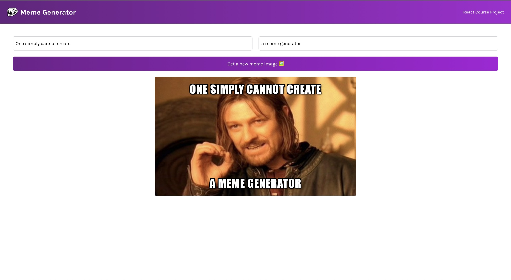

# Meme Generator App using React

A small project to practice and strengthen basic concepts of React such as useState, useEffect for fetching data and React forms.

## How to run the project 🚀

Follow the below steps to run this project:
```
1. Run the command npm run start in terminal to start the app at port 3000.

2. Go to the browser.
```

## Snapshot 📷




## Demo 🎥

Deployed Link: [Meme Generator](https://meme-generator-app-react.vercel.app/)

